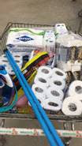

Banheiros
========================

Organizar a limpeza periódica, a cada 2h. O ideal é alguém ficar responsável pela limpeza dos banheiros, assim como o reabastecimento em sabão e papel. Na Pycon Amazônia tínhamos uma pessoa dedicada à limpeza.

