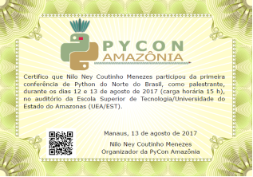

Certificados
========================

É incrível a demanda dos participantes por certificados. Preparar desde o registro todas as informações necessárias para emissão dos certificados. Na Pycon Amazônia, um script Python que lia os dados a partir de um CSV gerado durante o registro pelo Excel chamava o Inkscape com um template SVG.

