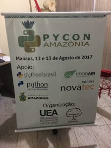

Faixas
========================

Faixas podem ser impressas na semana do evento. A arte deve ser preparada antes, pois existe um risco de problemas de compatibilidade com o formato dos arquivos utilizados pela gráfica.

Um detalhe importante a lembrar é como estas faixas serão pregadas, prever a compra de fitas adesivas dupla-face, tachinhas e outras fitas antes do evento.

